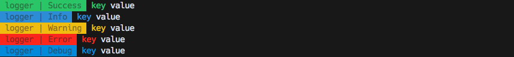
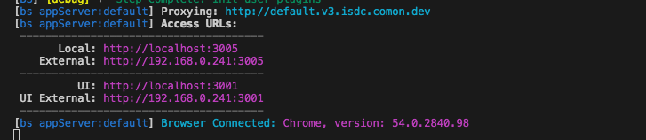
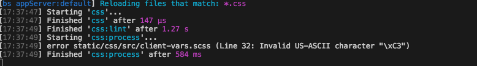
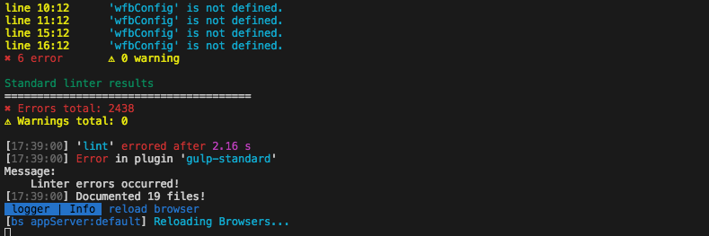

Die folgenden Konfigurationen gehören in das 'tasks' Objekt der application.conf.js

---

<!-- TOC depthFrom:1 depthTo:4 orderedList:false withLinks:true -->

- [common](#common)
    - [Logging](#logging)
    - [Clean](#clean)
    - [Doc](#doc)
- [Javascript](#javascript)
    - [lint](#lint)
    - [uglify](#uglify)
    - [js](#js)
- [Css](#css)
    - [Process](#process)
    - [Lint](#lint)
    - [css](#css)
- [Test](#test)
    - [Unit](#unit)
    - [E2E](#e2e)
    - [Mocha](#mocha)
- [Comon](#comon)
    - [Server](#server)
    - [Inject](#inject)
    - [Build](#build)

<!-- /TOC -->

---

### common
<a name="logging"></a>
#### Logging 
Es gibt ein generelles logging Modul welches konfiguriert werden kann um die Tasks zu debuggen.

##### Config
```javascript
tasks: {
  log: {
    selectors: ['isdc', 'default'], // nur für die Anzeige gedacht
    levels: ['success', 'warn', 'info', 'debug', 'error'] // loglevels
  }
}
```
##### Preview


##### [Api](module-logger.html)

---

<a name="clean"></a>
#### Clean
Dieser Task kann Ordner und Dateien annehmen welche durch Ausführen des Tasks gelöscht/gesäubert werden.
Der Vorteil, die gelöschten Dateien landen im Papierkorb und können im Notfall von dort wieder hegestellt werden.

##### Config
```javascript
tasks: {
  clean: {
    files: [
      './static/js/dist/**/*.js',
      './static/css/dist/**/*.css'
    ]
  }
}
``` 
##### Usage
```bash
$ gulp clean
```
##### Preview
<script type="text/javascript" src="https://asciinema.org/a/4ip9zkk6xm22gvnc1z5hwfvi3.js" id="asciicast-4ip9zkk6xm22gvnc1z5hwfvi3" async></script>

##### [Api](module-clean.html)

---

<a name="doc"></a>
#### Doc
Dieser Task kann Dokumentationen aus Jsdoc-Kommentaren eurer Javascript Dateien generieren.
Diese Dokumentation wurde über diesen Task generiert! ;)
Siehe [JSDOC](http://usejsdoc.org/)

##### Config
```javascript
tasks: {
  doc: {
    files: ['README.md', './lib/**/*.js'],
    options: {
      opts: {
        destination: './docs/documentation/jsdoc'
      }
    }
  }
}
``` 
##### Usage
```bash
$ gulp doc
```
##### Preview
<script type="text/javascript" src="https://asciinema.org/a/2nwv9pdksr8onjgalxd3zf4yi.js" id="asciicast-2nwv9pdksr8onjgalxd3zf4yi" async></script>

##### [Api](module-doc.html)

---

<a name="javascript"></a>
### Javascript
<a name="lint"></a>
#### lint
Mit diesem Task werden angegebene js dateien über [eslint](http://eslint.org/) und [standard](http://standardjs.com/) gelintet

##### Config
```javascript
tasks: {
  js: {
    lint: {
      files: [
        'lib/**/*.js',
        'test/**/*.js'
      ]
    }
  }
}
``` 
##### Usage
```bash
$ gulp lint
```
##### Preview
<script type="text/javascript" src="https://asciinema.org/a/0y0hf7s720o876o8dl132g57s.js" id="asciicast-0y0hf7s720o876o8dl132g57s" async></script>

---

<a name="uglify"></a>
#### uglify
Mit diesem Task werden angegebene js dateien konkatiniert und über uglifyjs komprimiert. Dazu können logs entfernt werden

##### Config
```javascript
tasks: {
  js: {
    uglify: {
      outputName: 'default.min.js',
      outputPath: 'static/js/dist',
      options: {
        mangle: false,
        removeLogs: true
      },
      files: [
        '../default/static/js/src/**/*.js',
        'static/js/src/**/*.js'
      ]
    }
  }
}
``` 
##### Usage
```bash
$ gulp uglify
```
##### Preview
<script type="text/javascript" src="https://asciinema.org/a/7wwhtzvr5wh88yy31clyggd4h.js" id="asciicast-7wwhtzvr5wh88yy31clyggd4h" async></script>

---

<a name="js"></a>
#### js
Dieser Task wird automatisch konfiguriert wenn sowohl lint als auch uglify in der Config vorhanden sind.
Der Task führt die beiden Tasks dann  nacheinander aus.
Treten im Task [lint](#lint) Fehler auf wird der uglify Prozess nicht ausgeführt.

##### Usage
```bash
$ gulp js
```
---

<a name="css"></a>
### Css
Der Css Task übernimmt das kompilieren und linten eurer Sass oder Stylus Dateien.
Das sind aktuell die möglichen optionen, ich werde das ganze aber noch erweitern bei Bedarf.

#### Process
##### Config
```javascript
// wenn keine Vererbung stattfinden soll
tasks: {
  css: {
    process:{
      reprocessor: 'sass',
      ouputStyle: 'compressed',
      outputName: 'default.min.css',
      outputPath: './static/css/dist',
      files: ['./static/css/src/default.*', './static/css/src/widget.*']
    }
  }
}

// wenn Vererbung integriert werden soll
tasks: {
  css: {
    process:{
      preprocessor: 'sass', // could also be stylus or less maybe others?
      inheritance: {
        inheritFrom: [ './', '../default'],
        root: 'static/css',
        paths: [
          'src'
        ]
      },
      ouputStyle: 'compressed',
      outputName: 'default.min.css',
      outputPath: 'static/css/dist',
      files: ['static/css/src/default.*', 'static/css/src/widget.*']
    }
  }
}
``` 

##### Usage
```bash
$ gulp css:process
```

---

<a name="lint"></a>
#### Lint
##### Config
```javascript
// wenn keine Vererbung stattfinden soll
tasks: {
  css: {
    lint: {
      files: ['static/css/src/**/*.s+(a|c)ss', '!static/css/src/**/normalize.s+(a|c)ss']
    }
  }
}

``` 

##### Usage
```bash
$ gulp css:lint
```

---

<a name="css"></a>
#### css
Dieser Task wird automatisch konfiguriert wenn sowohl lint als auch process in der Config vorhanden sind.
Der Task führt die beiden Tasks dann  nacheinander aus.
Treten im Task [lint](#lint) Fehler auf wird der process Prozess nicht ausgeführt.

##### Usage
```bash
$ gulp css
```
---

<a name="test"></a>
### Test
Die Test tasks übernehmen die Ausführung verschiedener Test mechanismen, je nachdem was ihr in eurer Anwendung testen möchtet.

<a name="unit"></a>
#### Unit
Führt unit Tests über [Karma](http://karma-runner.github.io/1.0/index.html) aus. Dieser Task kann für verschiedene Zustände konfiguriert werden.

* Dev
  * Zustand während der Entwicklung
  * Jede Js Datei Einzeln
  * mit einer Integration zur Testabdeckung und Reporting für den Jenkins
  * diese Dateien werden (in diesem Beispiel) unter docs/ abgelegt
* Build
  * Zustand nach dem Uglify Prozess
  * minify Datei
  * kein Reporting, da der reporter hiermit nicht viel anfangen kann 

Ausserdem könnt Ihr verschiedene Frameworks damit nutzen. Ich nutze hier in erster Linie Jasmine.
Vorinstalliert sind:
* [jasmine](https://jasmine.github.io/)
* [jasmine-jquery](https://github.com/velesin/jasmine-jquery)
* [jasmine-matchers](https://github.com/JamieMason/Jasmine-Matchers)

##### Config
```javascript
tasks: {
  test: {
    unit: {
      dev: {
        frameworks: ['jasmine-jquery', 'jasmine', 'jasmine-matchers'],
        files: [
          './static/js/lib/**/*.js',
          './static/js/src/**/*.js',
          './test/unit/**/*.js'
        ],
        exclude: [
          './static/js/lib/jquery/**/*.js'
        ],
        preprocessors: {
          './static/js/src/**/*.js': 'coverage'
        },
        coverageReporter: {
          dir: './docs/coverage'
        },
        junitReporter: {
          outputDir: './docs/junit',
          outputFile: 'unitReport.xml'
        }
      },
      build: {
        frameworks: ['jasmine-jquery', 'jasmine', 'jasmine-matchers'],
        files: [
          './static/js/lib/**/*.js',
          './static/js/dist/**/*.js',
          './test/unit/**/*.js'
        ],
        exclude: [
          './static/js/lib/jquery/**/*.js'
        ],
        junitReporter: {
          outputDir: './docs/junit',
          outputFile: 'unitReport.xml'
        }
      }
    }
  }
}
```

##### Usage
```bash
$ gulp test:unit:watch // führt den watcher prozess für "dev" aus, der auf Änderungen reagiert
$ gulp test:unit:run // führt die tests für "dev" ein mal aus
$ gulp test:unit:build // führt die tests für "build" ein mal aus
```

##### Preview
<script type="text/javascript" src="https://asciinema.org/a/dccnbxf75sxbz0hoiy9fsm9k4.js" id="asciicast-dccnbxf75sxbz0hoiy9fsm9k4" async></script>

---

<a name="e2e"></a>
#### E2E
Führt End to End Tests aus. Aktuell mit folgenden Frameworks.
Ich überlege hier noch ob wir selenium und den chromedriver aus den node_modules nehmen und global installieren sollten um die installation kleiner zu halten.
Dazu gibt es aktuell Probleme mit einigen Frameworks und Firefox, daher ist der Chrome als standard definiert.
Auch hier versuche ich eine sauberere Lösung zu finden.

Beispiele für die Tests sind unter 'prj/tsak/test/e2e' zu finden.

* [protractor](http://www.protractortest.org/)
* [nightwatch](http://nightwatchjs.org/)
* [galen](http://galenframework.com)
  * Galen muss händisch für die kommandozeile installiert werden
  * [Hier](http://galenframework.com/docs/getting-started-install-galen/) gehts zur Anleitung 

##### Config
```javascript
tasks: {
  test:{
    e2e:{
      protractor: {
        files: './test/e2e/pro/**/*.js'
      },
      nightwatch:{
        files: './test/e2e/nt/**/*.js'
      },
      galen:{
        files: './test/e2e/galen/**/*.js'
      }
    }
  }
}
```

##### Usage
```bash
$ gulp test:e2e:protractor 
$ gulp test:e2e:nightwatch
$ gulp test:e2e:galen
```

---

<a name="mocha"></a>
#### Mocha
Das [Mocha](https://mochajs.org/) Frameowork nutze ich um zb. die Tasks zu testen. 
Also alles was an Funktionalität innerhalb der Entwicklungsumgebung per Javascript gesteuert wird kann mit Mocha getestet werden.
Beispiele für die Tests sind unter 'prj/tsak/test/common' zu finden.

Hier werden für verschiedene Test Arten auch weiter Libraries benötigt.
vorinstalliert sind:
* [chai](http://chaijs.com/)
* [sinon](http://sinonjs.org/)
* [mock-fs](https://github.com/tschaub/mock-fs)

##### Config
```javascript
tasks: {
  test:{
    mocha:{
      test: [
        './test/**/*.js'
      ],
      src: [
        './lib/common/**/*.js'
      ]
    }
  }
}
```

---

<a name="comon"></a>
### Comon
Hier nun die Tasks die eher comon spezifisch sind

<a name="server"></a>
#### Server
Der Server Task startet eine browsersync session welche den in der application.conf.js konfigurierten host über einen Proxy verfügbar macht.
Dieser Server kann dann auf verschiedene Events reagieren die ihr konfigurieren könnt.

##### Config
```javascript
var applicationConf = {
  host: 'http://default.v3.isdc.comon.dev', // url die geproxyt werden soll
  prefix: 'default', // selector der in der Konsole angezeigt wird
  path: 'de/DE/' // pfad der angehangen werden kann, ich nutze das häufig bei projekten die multi mapping haben
  tasks:{
    watcher: {
      refresh: [
        './static/css/src/**' // bei Änderungen in angegebenen Pfaden wird ein refresh ausgeführt. Macht hauptsächlich für css Sinn
      ],
      reload: [
        './tmpl/**/*.tmpl', // bei Änderungen in diesen Pfaden wird der browser neu geladen
        './static/js/**/*.js'
      ],
      rebuild: [
        './application.conf.js' // bei änderungen in diesen Pfaden wird der Inject task neu ausgeführt, Dies werde ich auch noch etwas ausarbeiten 
      ]
    }    
  }
}
```

##### Usage
```bash
// nur der Server watch tasks
$ gulp server
// server mit watcher tasks
$ gulp
// oder 
$ gulp default 
```
##### Preview


Die angegebenen Urls können nun im Browser geöffnet werden.
Wenn die entsprechenden Tasks konfiguriert sind passieren nun folgende Dinge:
* Änderung an .css/.scss/.styl
  * wenn konfiguriert lint und processing
  * *.css Dateien im Browser werden versioniert, kein harter Reload 

* Änderung an .js
  * wenn konfiguriert lint
  * browser Reload
  * kann hier leider keinen vernünftigen Screenshot anhängen da das linting im default projekt über 2000 warnungen und fehler auswirft
* Änderung an .tmpl
  * browser Reload

* Änderung an application.conf.js
  * inject wird neu ausgeführt
  
---

<a name="inject"></a>
#### Inject
Dieser Task sammelt über die angegebenen Pfade alle Dateien die benötigt werden und schreibt ein Template.
Auch hier gibt es zwei varianten

* Dev
  * Zustand während der Entwicklung
  * Jede Js Datei Einzeln
* Build
  * Zustand nach dem Uglify Prozess
  * minify Datei 

##### Config
```javascript
tasks: {
  inject: {
    outputPath: './tmpl/base',
    outputName: 'js.tmpl',
    dev: {
      root: 'static/js',
      inheritFrom: ['./'],
      files: [
        'lib/jquery/dist/jquery.min.js',
        'lib/*.js',
        'src/**/*.js'
      ]
    },
    build: {
      files: [
        '{config:project:uri_jquery}',
        '{static:js:dist/default.min.js}'
      ]
    }
  }    
}

```

##### Usage
```bash
// für dev
$ gulp inject:dev
// für build
$ gulp inject:build 
```
  
---

<a name="build"></a>
#### Build
Der Build Task führt diverse tasks aus welche aus dem Entwicklungszustand den Produktivzustand erstellen. 

* Task Clean wird ausgeführt um vorherige Build Dateien zu löschen
* Task Js wird ausgeführt um das Javascript zu Linten und Minify'en
* Task Doc wird ausgeführt um eine dokumentation zu erstellen
* Task inject:build wird ausgeführt um die Build Quellen zu integrieren
* Task Test wird ausgeführt | dieser Task ist oeben nicht beschrieben, er führt alle Test Tasks aus die konfiguriert sind

Dies ist der Task der letzendlich vom Jenkins oder einem anderen Continous Integration/Deployment Tool ausgeführt wird.
Wirdt dieser Task keine Fehler aus kann die Anwendung entweder händisch oder vom entsprechenden Ci produktiv gestellt werden.

##### Usage
```bash
$ gulp build

```  
---


